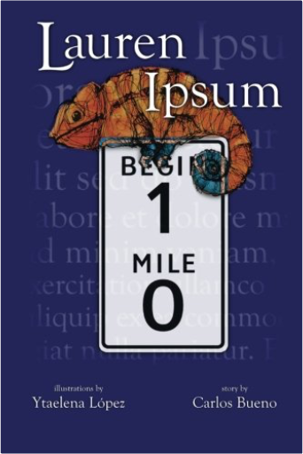

[Art in Children’s Books](https://medium.com/@rushabh_mehta/art-in-childrens-books-8cbd74ee0a5?source=post_page---------------------------)  talks about the importance of good books (Hurray for Tintin!) when it  comes to making children grasp the wonders of the wide world. But the  (relatively) new field of programming is popularly considered arcane,  partly because it derives from and touches upon so many other domains.  But what gets hidden behind all that detail is that it is actually a way  of thinking, and hence it isn’t generally thought of as something you’d  teach to little kids.

<!--more-->

And yet there is a little gem that does exactly that, and more. [Lauren Ipsum](http://www.laurenipsum.org/?source=post_page---------------------------),  based only tangentially on Alice in User- er, Wonderland, is an  adventure tale that makes for a great setting to discover new ideas and  solve problems. It starts off by getting the point right across that  Computer Science has little to do with the machine —

> You  can see the moon and stars without a telescope, smell the flowers  without a fluoroscope, have fun without a funoscope, and be silly sans  oscilloscope.

*I kinda liked this old cover better.*

The  protagonist is a little girl Laurie, who gets lost in the woods, and  with the help of a color-blind chameleon named XOR, has to find her way  home through:

> Jargon-infested swamps, gates guarded by perfect logic, and the perils of breakfast time at the Philosopher’s Diner.

Her encounter with Tinker (and a shout-out to Logo) is an excellent example of simulating computer instructions:

> “What?  No, it’s just a fancy way of saying ‘how to do something’. But  ‘Algorithm’ looks more impressive on the sign,” said Tinker.
>
> “This turtle can do three things: it can move forward or backward, it can turn, and it can draw a little dot on the paper.”

How little Laurie comes up with the steps to solve a problem like the wolf, the goat and the [Mandelbroccoli](http://www.fourmilab.ch/images/Romanesco/?source=post_page---------------------------) (kudos to whoever [named](https://en.wikipedia.org/wiki/Mandelbrot_set?source=post_page---------------------------) it in real life) is more about the use case than the solution. (Except, of course, it depends on how you choose to [solve](https://xkcd.com/1134/?source=post_page---------------------------) it.) It gets all the more interesting when the story confounds seemingly obvious things:

> It’s easy for an idea to be simple, logical, and *false*.

The  end twist is excellent, the epilogue is a real historic story and the  notes section is genius in itself. The big guns in physics have special  appearances. Heck, the [chapters list](http://www.laurenipsum.org/sample?source=post_page---------------------------) alone makes one feel at home. And all your favourite CS concepts that didn’t get a full scene at least get a cameo:

> …  I’ve seen the sunrise over the Towers of Hanoi and climbed the Upper  Bounds. I’ve sat down at the Lookup Table and floated on the Overflow  River. — The Travelling Salesman

It does all of this while teaching rationality, like why ‘weird’ is relative:

> “I’m  not eating them funny.” Instead of cutting through the pile of  pancakes, Winsome ate them off the top of the stack, one by one. “You’re  eating them funny.”

And consequently, why you shouldn’t think it weird to try new things:

> But if everything already existed, life would be pretty boring. — Fresnel

It’s  mind-boggling to think about the amount of work that goes into the  making of something like this. Carlos Bueno talks about the [type II kind of teaching](http://www.laurenipsum.org/teaching-is-compression?source=post_page---------------------------), that isn’t about the transmission of knowledge:

> The  second type of teaching is a form of compression, making things easier  to understand. I don’t mean simply eliding details, or making your  proofs more terse. I mean compression in the time it takes to explain an  idea and its implications.

The  idea isn’t limited to teaching, but documenting in general. It’s what  we do when we refactor and document code: readability is just as  important as optimality.

Lauren  Ipsum radically changes the way many people look at CS, which has often  not been considered ‘engineering’, because of the flaw in its  understanding in general, that it is a mindset; a way of looking at  things differently. But it has always been so with every field. After  all,

> My word, *people died*  in arguments over the Pythagorean Theorem. Now we teach it to kids in a  half hour. If that’s not progress I don’t know what is. — Carlos Bueno

With pieces of brilliance like Lauren Ipsum, so will it be for programming.

------

*Lauren  Ipsum is a book written by Carlos Bueno. It is one of the best books to  teach children how to think that you’ll find, and the motivations  behind it are equally fascinating. You can read all about them at* [*http://www.laurenipsum.org*](http://www.laurenipsum.org/?source=post_page---------------------------)

