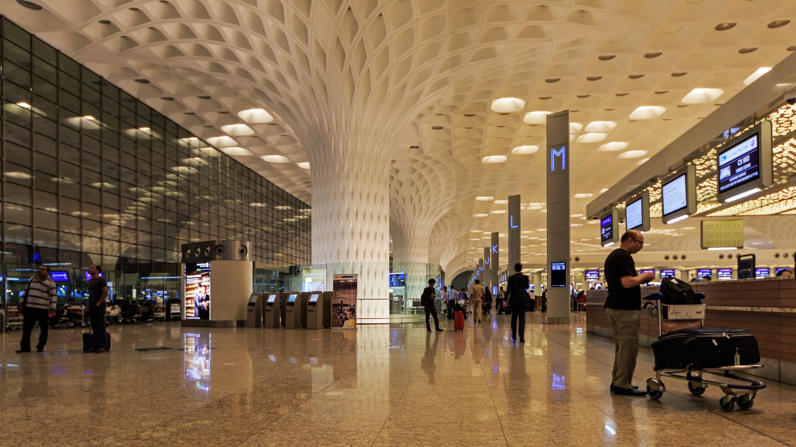
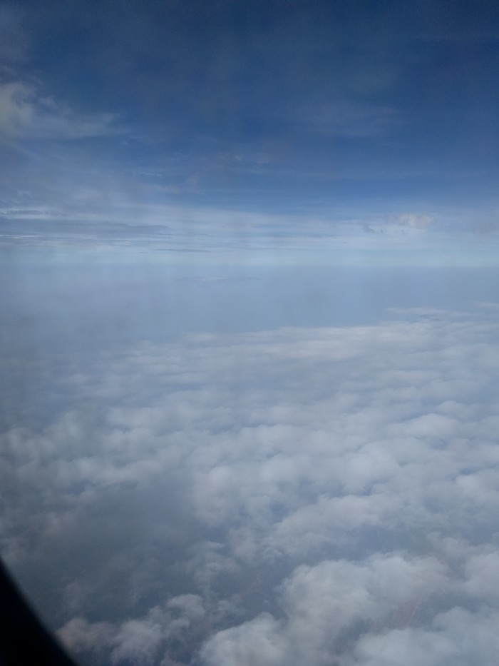

Some weeks back, our team had organized a code sprint at Kozhikode, one of  the first sprints organised away from our office in Mumbai, and I was  lucky enough to be one of members who were to go. To me, it was going to be a new experience on so many levels, with the first stage being  probably the most exciting of all.

<!--more-->

All the time on the way to the airport that day I was thinking about how it came to be, and the time I  received my first ever flight ticket. On reaching the terminal, I  recalled the couple of times I had been there to see my brothers off.  The entrance would seem like a portal to another world, even more so  when we would chat on phone after they had passed inside the building,  while looking at them through the golden glass. That day, I got to go  inside.

I couldn’t help rubbernecking at the surroundings all the time we were there

It was even bigger than it looked on the outside. It was new territory to  all of us, and took some time to navigate. Once we figured out the  counter where we had to go for the boarding passes, we rushed to the  queue and weren’t too early, and were asked to wait for some time to get available seats. We received the passes, and instead of economy seats  we were entitled to, they were business class. We couldn’t believe our  luck. We took off to the gates, talking about the odds of that  happening, and the only thing stopping me from skipping gleefully ahead  was my heavy backpack.

We were given the privilege of boarding before others. Only to find huge  cushioned seats, with plenty of buttons, and bits coming off and fitting back like a swiss army knife. And being asked for choices in an offered complimentary breakfast. And the aircraft hadn’t even started to move  yet!

Once the announcements began and the doors were closed, I had absolutely no  idea of what was going to happen next, and looked out the window for  some cues. Sure enough, there was another plane ahead that was visible,  that demonstrated all the stages before take-off. Then slowly, our own  plane began to move. By the time we reached the runway anticipation was  sky-rocketing, and then suddenly, the engines accelerated to full speed  and in seconds, we were no longer on the ground. I could already see the Mumbai coast fall back and below rapidly as we started ascending. We  were airborne!

The journey would take about a couple of hours, and for the entire time I  couldn’t take my eyes of the window. How lucky was it that we were  flying along the coast? We had a bird’s eye view of the shape of the  real coastline that we’d only seen in maps before. Nearer up, there were just so many different kinds of clouds. Small, fluffy ones below, the  long streamlined ones higher above telling of the oncoming monsoons, and dark ones far away over the sea, which at first looked like islands.

Just as we were about to reach our destination, the flight had to change  direction for the airstrip. The swerve was exhilarating; if it hadn’t  been for the window, we’d have lost all sense of reference. And yet, the landing was so smooth we didn’t even feel the touchdown. It’s amazing  how something so big and heavy and moving so fast can land without the  slightest jolt.

Getting off the plane, we saw that we were at a height, the horizon visible all round, which was why we thought we landed a bit too early. We were all  out in the breeze, beaming, knowing that we’d never forget the  experience.