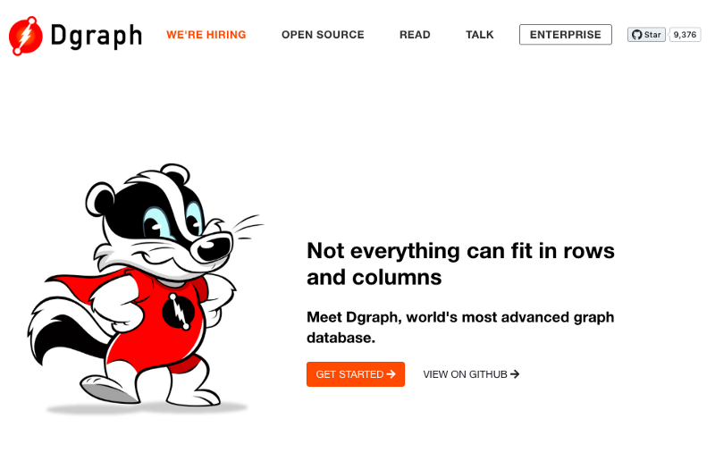

On request: some thoughts on a proposed talk for JSFoo: [Not everything can fit in rows and columns](https://hasgeek.com/jsfoo/2019-coimbatore/proposals/not-everything-can-fit-in-rows-and-columns-iWAwizwbfHoaDmpDBw5iQV) by Ashok Vishwakarma

<!--more-->

#### Primary goal

Make developers aware of the benefits [**Dgraph**](https://dgraph.io/) and get started with it in JavaScript.

*[https://dgraph.io/](https://dgraph.io/)*

#### **First Half**

Presenting a more performant and easier-to-connect-schemas alternative to Relational Databases are Graph Databases, in which Dgraph is a frontrunner. The talk is comprehensive about the benefits and explains the scenarios it is effective in.

#### **Second Half**

Dgraph has official clients in [Go](https://github.com/dgraph-io/dgo), [JS](https://github.com/dgraph-io/dgraph-js) and [Java](https://github.com/dgraph-io/dgraph4j). Using a client requires getting acquainted with quite a bit. Hence, the speaker has built an ORM (an easier API wrapper) around the JS client that makes it easier for folk to get started with a familiar syntax.

#### Metrics

- **Relevance to JSFoo**: Reasonably sound.
  From a past conversation with Rasagy from the HasGeek team, it was quite clear that the JSFoo has a broad range of talks. As this talk helps JS developers get up to speed with bleeding-edge technology, it counts as purposeful.
- **Novelty:** In good measure.
  A fresh discussion over database technology, and relating data in graph structures in order to more efficiently perform complex joins and queries, it justifies that there are options other than relational databases that have been shown to be better.
- **Clarity**: Fair.
  The relevance point above shows purpose. However, aside from the proven benefits of Dgraph, it seems that the ORM library `dgraph-orm` by Ashok is proposed as the utility to enable using Dgraph in JS, rather than the [official client](https://github.com/dgraph-io/dgraph-js).
  If this is the case, and it is meant to be used in production by the audience, I’d like to see, if possible, some concrete applications already using the ORM, given that it has been quite recently released (a couple of months ago). I hope that this will be covered in the live demo. (It was one of the reasons we demonstrated the live use of Charts and FrappeJS in real products to show their impact during JSFoo Pune). If it is not, some resources to enable advanced use of Dgraph would be helpful.
- **Will you listen to this talk if you were sitting in the audience?** Mostly yes.

