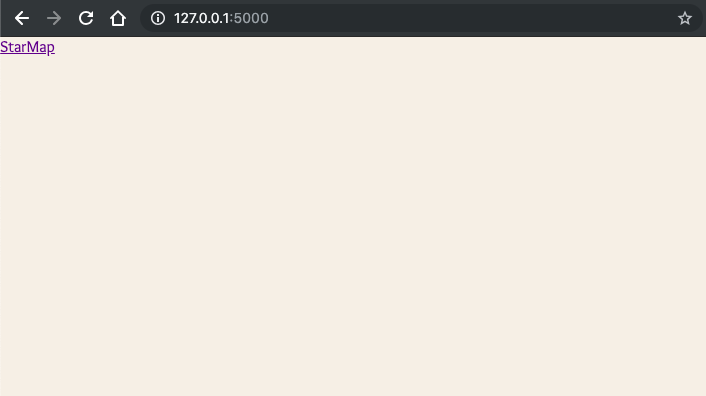

Making learning more reciprocative through a vision of what it'd be like after the learning is complete, is very similar to how good products are designed.  

<!--more-->

## Purpose

Usually, the core **purpose** of a course involves a project. Starting with an application scope and real-world impact. A problem/need that someone will wish to solve, even if it is a project made for fun. The primary source of motivation.

Suppose we have to teach building “A star-map with constellations and ISS location whenever it passes overhead.”

The motivations on both sides of the learning process would be tricky to align, with respect to the technology being introduced and the application being built:

Teacher's POV:

> “We have to teach how to use libraries and request APIs. Let’s use d3-celestial and `whereissat` to help learners build something interactive.”

Student's POV:

> “Oh boy, we’re building a skymap! Can’t wait to see real stars on the screen, like the Stellarium app. Hope it doesn’t take too long, though. And will we be using VueJS? I’ve heard it’s pretty cool, and all major companies use it.”

Hence, in addition to being relatable with a learner, it is a good idea to not just tell, but demonstrate the impressiveness of the taught tech.


## Appreciation by pre-context

One of the ways to drive the impact home is starting by asking and stimulating learners on how would *they* themselves go about building the app, given their current knowledge and/or tools, or better yet, what are the problems that need solving here. Correct answers are not required, only to enable learners to get into the zone of thinking about problems that seem tricky:

> “Our web-app will show dots for stars on the screen, rather than plain text. Do you think HTML allows this?”

> “It would take quite some time gather data for the positions for stars ourselves with a telescope, even if we were passionate stargazers, or even astronomers. Fortunately, for field-spanning data that is widely useful (like star data), someone usually already does the work and publishes it to make it all-accessible. Any online resources that you can think of, where they can be acquired?”

> “We’re building a web app that has a single page and is interactive. Such webapps are called SPAs. Can you find some of the common techs used for this?”

After this, the introduction of the specific technologies that actually help solve these non-trivial problems (canvas, online datasets, React) really makes someone new to appreciate the said impact.

**In other words, the classic “What if I told you …” technique.**

Actual examples, even better, in real, live applications, throughout this can drive the scope much firmly than documentation.

The work needed to produce this effect isn’t necessarily straightforward, but it isn’t impossible, and always worth the effort.

The answers to these questions now can lead to the individual stages of the entire project.


## Logical Stages

A stage is defined by a clear goal that achieves a checkpoint in the project, usually centred around a single layer or feature or tech.

An example stage: **An app in Flask**

Starting with motivation as before:

*“A few lines of code to create a server that serves your app.”*

At this stage, demonstrating a high ROI (return on investment) is important. Less time, less code, etc.

Follow a series of steps that need to be performed (I do like the use of graphics, where possible and time permits):

- import Flask
- Webpages for routes
- Start the server by executing the file

And then, if needed, show and teach it as the code, in order to quickly lead to the first reward:

```
from flask import Flask, render_template
app = Flask(__name__)
@app.route("/")
def home():
 return render_template("home.html")
@app.route("/sky")
def sky():
 return render_template("sky.html")
if __name__ == "__main__":
 app.run(debug=True)
```

Feedback is important to keep seeing the effects every line of code has. When completed, a learner gets their very first reward:


*A live web page running on a local flask server*


This counts as the first major “aha!” moment for a learner.

Some more trivia during this period can serve as motivation fuel:

*“As opposed to Django, Flask is a microframework. Which means it is extremely lightweight and you can hook up components as per your need.”*

After which we can get to next steps, into more detail, usually also touching on what was just coded/taught.

In our example, further steps like:

- Jinja templating 
- Routing 
- Static assets

Various stages can have a similar pattern.

So far we’ve what can, in the ideal world, work to keep a learner’s motivation throughout a journey. We’ll take a look at some the approaches that can be used to automate most of the above in the next post.

------

*It  is worth noting how similar this is to user onboarding. And just like  it, it is very iterative, and not free from testing what works and what  doesn’t.*

*Being no expert myself as a teacher, a reasonable approach is to find out what worked from* me  *as a student, and observing the mentoring techniques of teachers of  tech that have helped at least my own self the most to learn.*