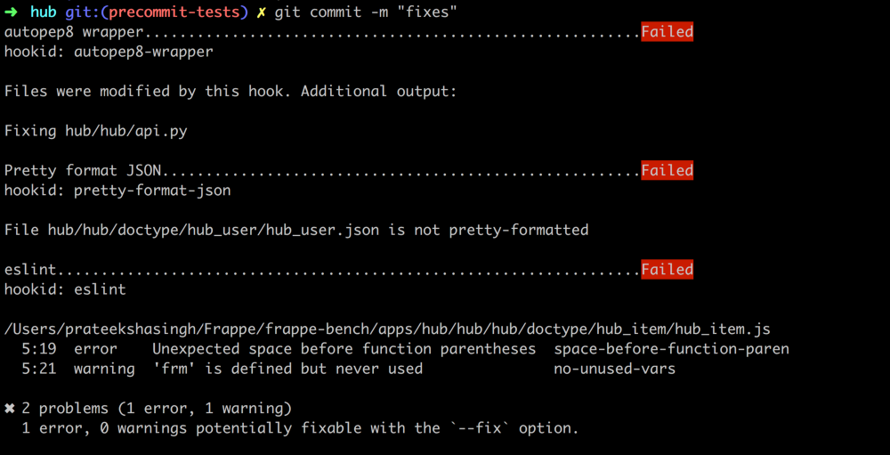

Code-formatting  is the one thing we consistently care about in software. However, it  isn’t a difficult problem to solve these days; with an assortment of  plugins for your favourite editor, you can easily check your code on  save, or even on the fly. <!--more--> 

What’s a bit less trivial is to maintain the  same rules across the team and contributors. Unless you have a step like  linting incorporated in a build process, a person pushing code may or  may not consciously know to perform checks manually.


GitHub  lets us incorporate great apps like Codacy, to perform post-push-checks  on the server, and prevent incorrectly-written code from slipping  through (especially useful as a PR review stage). The trouble is, the  contributor wouldn’t know about issues until after they’ve already  committed, often resulting in a push-and-check workflow:


## Aside: What are Git hooks

Git  allows you to fire off scripts on events in the git life cycle. You can  do this by defining the scripts in event hooks. Take a look inside the  .git/hooks directory of your git repo, and you’ll find many of the  available hook samples (Notice how they correspond to git events; the  .sample extensions is what keeps them from executing):

```
...
pre-commit.sample
prepare-commit-msg.sample
commit-msg.sample
pre-push.sample
...
```

Here’s what the commit-msg.sample looks like:


```shell
#!/bin/sh
#
# An example hook script to check the commit log message.
# Called by "git commit" with one argument, the name of the file
# that has the commit message.  The hook should exit with non-zero
# status after issuing an appropriate message if it wants to stop the
# commit.  The hook is allowed to edit the commit message file.
#
# To enable this hook, rename this file to "commit-msg".

# Uncomment the below to add a Signed-off-by line to the message.
# Doing this in a hook is a bad idea in general, but the prepare-commit-msg
# hook is more suited to it.
#
# SOB=$(git var GIT_AUTHOR_IDENT | sed -n 's/^\(.*>\).*$/Signed-off-by: \1/p')
# grep -qs "^$SOB" "$1" || echo "$SOB" >> "$1"

# This example catches duplicate Signed-off-by lines.

test "" = "$(grep '^Signed-off-by: ' "$1" |
	 sort | uniq -c | sed -e '/^[ 	]*1[ 	]/d')" || {
	echo >&2 Duplicate Signed-off-by lines.
	exit 1
}
```


While  the samples are in shell or PERL, hooks can be written in any scripting  language by changing the `#!/bin/sh` at the beginning of the file to  the path to your interpreter. (If you’d like to learn more, Bitbucket  has a great [guide](https://www.atlassian.com/git/tutorials/git-hooks?source=post_page---------------------------) to help you write your own hooks.)

However,  frequently used hook scripts can still be difficult to manage.  Fortunately, there are plenty of tools to easily set the most commonly  used pre-commit hooks.


## Managing hooks with pre-commit

For a project that contains code in multiple languages, the actively-maintained framework [pre-commit](https://pre-commit.com/?source=post_page---------------------------) can take care of most use-cases.

### Step 1

Install the pre-commit pac-man that will take care of installing requirements:

```shell
$ pip install pre-commit
```

### Step 2

There  are a couple of steps to setup pre-commit in your git repository.  First, it needs a .pre-commit-config.yaml file, which specifies  top-level options, repos and hooks from each repo. As a basic example,  here is a sample configuration, where we add some checks for Python ,  JSON and JS:

```yml
repos:
-   repo: https://github.com/pre-commit/pre-commit-hooks
    rev: v1.2.3    hooks:
    -   id: autopep8-wrapper
    -   id: pretty-format-json-   repo: https://github.com/pre-commit/mirrors-eslint
    rev: v5.0.1    hooks:
    -   id: eslint
```

This tells pre-commit to use autopep8-wrapper and pretty-format-json from the [pre-commit/pre-commit-hooks](https://github.com/pre-commit/pre-commit-hooks?source=post_page---------------------------) GitHub repo and so on. The [Supported Hooks](https://pre-commit.com/hooks.html?source=post_page---------------------------) page is a good reference for the available hooks and mirrors.

### Step 3

Now  you can install pre-commit to your .git/hooks directory by running  pre-commit’s install command inside the root directory of your  repository:

```shell
$ pre-commit install
```

Here’s the output:

```shell
pre-commit installed at /Users/prateekshasingh/Frappe/frappe-bench/apps/hub/.git/hooks/pre-commit
```

This means that from here on, pre-commit will run on every commit to the ‘hub’ repository.

### Step 4

Go ahead and commit.



*We’ll see how we can also fix the uncontextual commit message in a bit*


Notice how the file modifications done by autopep8 were also performed in this stage.

The  first commit after install will take a while to install packages and  setup the environment to run hooks in. Thereafter on every commit  command, if any of the hooks return a fail, the staged files will not be  committed.


## Going Further

Pre-commit supports an impressive number of hooks, everything from [blackening code blocks in Python documentation](https://github.com/asottile/blacken-docs?source=post_page---------------------------) to linting commit messages:


*[commitlint](https://github.com/marionebl/commitlint?source=post_page---------------------------) also has a supported [mirror](https://github.com/alessandrojcm/commitlint-pre-commit-hook?source=post_page---------------------------)*


Explore more on their [documentation](https://pre-commit.com/?source=post_page---------------------------#pre-commit-configyaml---top-level), to run hooks at other stages, pass arguments, or even make your own hooks. Kudos to the [pre-commit team](https://pre-commit.com/?source=post_page---------------------------#contributors) for being awesome.

------

*If  your project uses Node.js, hook scripts are even easier define in the  package.json with tools like Husky and lint-staged. For starters,* [*@bartwijnants*](https://medium.com/@bartwijnants/using-prettier-and-husky-to-make-your-commits-save-2960f55cd351?source=post_page---------------------------) *wrote up a great post on Husky* [*here*](https://medium.com/@bartwijnants/using-prettier-and-husky-to-make-your-commits-save-2960f55cd351?source=post_page---------------------------)*.*